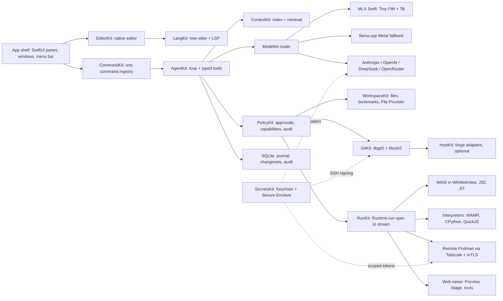
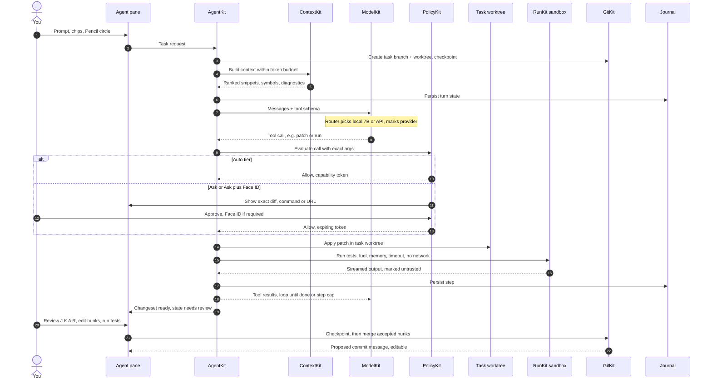
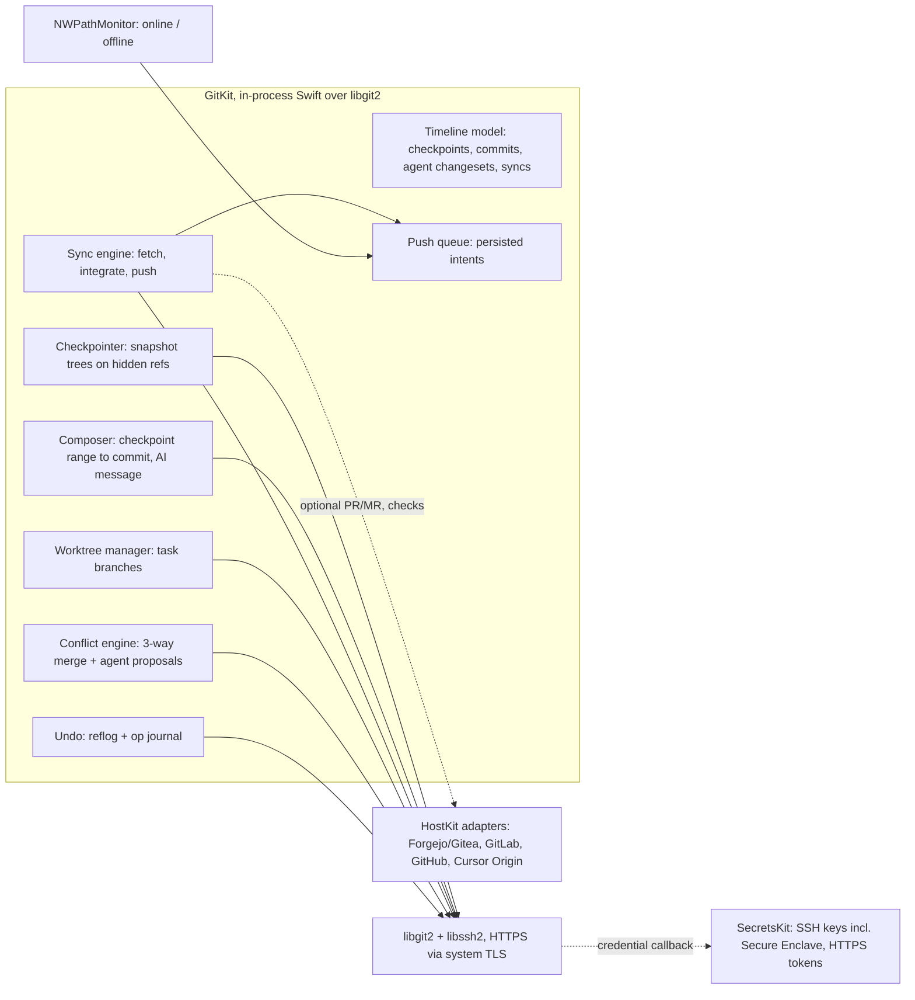
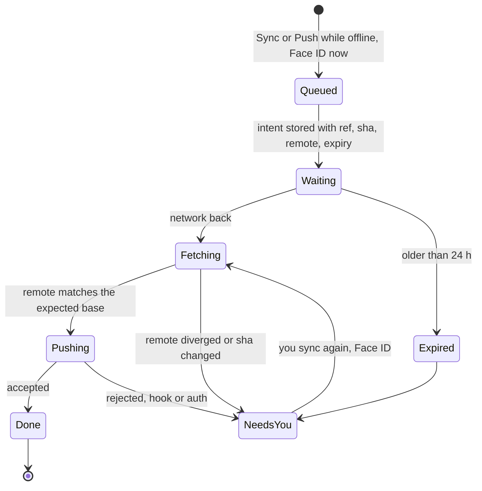
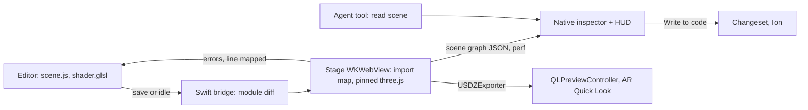
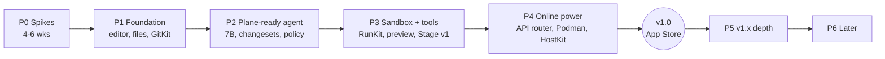

# Omnie-dev: Architecture and Product Plan

**Status:** plan only. Nothing is built, no repo exists. Written 8 Oct 2026. This replaces `iPad-IDE-Architecture.md` (v1) and pulls in its sources: SUPERDEV (app, runtime, git, terminal, LSP), FORGE (models), ADA (security and App Store 2.5.2), and Percival (UX and brand).
**Target device:** 13-inch iPad Pro M5 with **12 GB RAM**, iPadOS 26.
**Brand:** the full brand spec and design tokens are in `/workspace/ipad-ide-brand/` (`BRAND.md`, `tokens.json`, `contrast.json`). §3 summarizes them.
**Name:** **Omnie-dev** (chosen 8 Oct 2026). Where this doc says "the app", it means Omnie-dev. Trademark and App Store name checks are still to do (§2.4).
**Bundle ID:** `ai.wckd.omniedev`. Extensions and containers derive from it (for example `ai.wckd.omniedev.fileprovider`, `iCloud.ai.wckd.omniedev`).

> **How to read the numbers.** Every speed, memory and size figure here is an **estimate** from the specialist sections or from first-principles math. None of it has been benchmarked on an M5 iPad. Anything still to be verified is marked *(verify)* and listed again in Appendix A.

**Devices:** one universal app. **iPad is the full IDE** (everything in this doc). **iPhone is for vibecoding** (§13.2): agent-first, so you describe, review, preview and sync, with light editing only. The experience is picked by device, not window width.

> **Superseded in part (9 Oct 2026).** The newer *Omnie-dev: complete plan* (94-page PDF, 9 Oct 2026; not stored in this repo) adds the final icon (the seamed O), ten UI mockups, §5.1 (editor engine), §9 LinuxKit (emulated Alpine via iSH, first-class), §10 HarnessKit (Pi, DSH), §12 RemoteKit (SSH, tmux control mode, mosh), §27 open source and licensing, and §28 decisions. Where they differ, the PDF wins. Its decided items, as applied to this repo:
>
> - **Who and how:** a personal tool for its author's daily use, shared openly. No business model. Install by Xcode sideload or TestFlight; the App Store is optional later.
> - **License:** Apache-2.0 for our code. Once iSH is vendored, the shipped binary is a GPLv3 combined work carrying iSH's LICENSE.IOS. DCO sign-off, no CLA. Name and icon under TRADEMARKS.md.
> - **Repos:** GitHub `wckdboy` is canonical. This monorepo holds the app and every Kit (`apps/ipad`, `packages/*Kit`, `brand/`); six satellites are planned (`omnie-dev-editor-engine`, `-ish`, `-native-deps`, `-harness`, `-runner`, `-packs`).
> - **Editor:** a Runestone-derived Core Text engine we own for code; TextKit 2 for prose. Locked after the P0 spike.
> - **Remote terminal:** RemoteKit on libssh2 (shared with GitKit), SwiftTerm, tmux -CC, mosh.
> - **Routing:** Auto by default (local offline, API online, always labeled); per-project Local-only.
> - **Runners:** single-tenant, Hetzner plus your Mac over Tailscale, gVisor under rootless Podman.
>
> **Difference from the PDF:** the PDF describes an iPad-only app. This repo builds a universal app (iPhone gets the agent-first vibecoding shell, §13.2 below), per the author's instruction on 8 Oct 2026.

---

## 0. TL;DR: the plan in ten lines

1. **A native, offline-first iPad IDE built for agent-assisted coding.** Swift owns everything you touch. Web views only *run* code and render previews.
2. **Two visible authors.** Every line shows whether you (Ion cyan) or the agent (violet, Monaspace Xenon) wrote it: in the gutter, the diff, the timeline and blame.
3. **The agent proposes and the policy engine decides.** The agent never edits silently. Its work lands as a changeset on its own branch, with a checkpoint before anything is applied. Face ID guards anything risky. Keys never reach the model or the sandbox.
4. **Git you mostly don't see.** Checkpoints happen automatically and become commits with editable AI-written messages. A timeline replaces `git log`, one gesture syncs, and pushes made offline wait in a queue. Power tools sit one level down.
5. **Works anywhere git works.** Any SSH or HTTPS remote is a full citizen: Forgejo/Gitea, GitLab, Cursor Origin or GitHub. Forge features (PRs, checks) are optional adapters.
6. **Plane-complete.** A Tiny FIM model plus a 7B coder at 4-bit run locally (MLX Swift, llama.cpp as fallback), with a 4 to 8k agent context. WASI in WKWebView (JSC JIT) plus interpreters stand in for the sandbox, alongside an offline docs and package cache.
7. **Real containers when online.** Rootless Podman runs on your Hetzner box or your Mac over Tailscale, behind the same `Runtime.run(spec)` API. The agent and terminal never care where a job runs.
8. **A built-in 3D stage.** An offline three.js viewer and playground: glTF/GLB/OBJ/STL/USDZ, live reload, GLSL/WGSL hot reload, inspector, performance HUD, Pencil orbit, and AR Quick Look export.
9. **Curated tools, not a plugin store.** Guideline 2.5.2 rules out third-party extensions, so we turn that into an opinion: about a dozen built-in tools that work offline, each excellent.
10. **Honest about iPadOS.** No Docker on the device, no fork/exec, no JIT outside WebKit, no background daemons. The UI says what works offline instead of spinning forever.

---

## 1. The hard truth: what iPadOS allows

Third-party iPad apps can't fork/exec or spawn processes, can't JIT in their own process, can't use Hypervisor/Containerization, can't load unsigned native code, and get suspended in the background.

| Want | On the iPad, offline | When online |
|---|---|---|
| Docker / Podman | **Not possible.** The closest equivalents are WASI "containers" (OCI artifacts with wasm32-wasi workloads plus a devcontainer.json-style spec) and an optional slow emulated Alpine VM | Real rootless Podman on a remote host |
| JS / TS / Vite-style dev | Yes: WKWebView with JSC JIT plus a Node API shim (no native addons, no postinstall) | Real Node remotely |
| Python | Yes: embedded CPython or Pyodide (pure-Python packages; native wheels limited) | Full Python remotely |
| C / C++ / Rust | Compile to wasm32-wasi and run sandboxed (slow, but it works) | Native builds remotely |
| Swift / Go / JVM / .NET / Xcode / Simulator | No | Remote (a Mac for Xcode) |
| Long-running background jobs | No general background execution. iPadOS 26 `BGContinuedProcessingTask` covers *user-started* finite jobs with system progress UI, and background GPU on M3-or-later iPads | Remote |
| Localhost dev server | Foreground only, previewed in-app | Remote, tunneled |

**Plane trick:** if you need real containers mid-flight, a MacBook in the bag (USB-C or peer Wi-Fi) becomes the container host over the same remote protocol.

**Entitlements we rely on:** `com.apple.developer.kernel.increased-memory-limit` and `extended-virtual-addressing` for model weights, and Background GPU Access for continued-processing tasks. All are requested at submission; none is a guaranteed number of bytes *(verify the real limits on the device)*.

---

## 2. Product identity

### 2.1 Manifesto: what Omnie-dev believes

1. **The iPad is a real computer for writing code, and a plane is a real place to write it.** Being offline is a normal mode, not an error. The offline glyph is grey, not red.
2. **Native or nothing for the hands.** Typing, selecting, scrolling and Pencil go through system text input at 120Hz. If it feels like a web page, it's wrong.
3. **Authorship is always visible.** You and the agent are two authors with two colors and two typefaces. Trust comes from seeing who did what, not from the agent's self-report.
4. **The agent is a strong junior on a leash.** It reads freely, proposes changesets, runs sandboxed tests and explains itself. It never pushes, never touches secrets and never edits silently.
5. **Git is a safety net first and a collaboration tool second.** Nothing you do should ever be lost, so checkpoints are automatic and undo is universal. Collaboration is one gesture away.
6. **Host-agnostic by principle.** Your code lives on whatever git server you choose. No forge is the default, and none is required.
7. **Few tools, sharp tools.** A dozen excellent built-in tools beat a marketplace of five hundred mediocre ones.
8. **Speed is a feature, and so is silence.** Color means something, motion only follows your input, and nothing blocks input, ever.

### 2.2 What it deliberately does NOT do

| We won't | Why |
|---|---|
| Ship a plugin or extension marketplace | Guideline 2.5.2 forbids extending the app at runtime. It's also a supply-chain and prompt-injection risk. Curation is the product |
| Use a web-view editor (Monaco/CodeMirror) as the main editor | Code App shows the cost: it feels like a web page. A web-view editor stays only as an internal hedge for one view (§5) |
| Pretend to be Docker on the device | We say "WASI container" or "remote Podman", never "Docker", unless it's real |
| Let the agent push, deploy, delete or use secrets without you | ADA's tiers. Face ID is the human signature |
| Default to GitHub, or to any one forge | The user is leaving GitHub, and git itself is the portable layer |
| Show a staging area by default | Most people never need it. Hunk staging is one tap away for those who do |
| Run a cloud backend that sees your code | No accounts or servers of ours are on the code path. Bring your own keys and your own hosts |
| Collect telemetry by default | All metrics stay on the device. Crash reports are opt-in |
| Build a Swift/Xcode replacement | Swift Playgrounds owns that. For Swift you use a remote Mac |
| Gamify the agent (sparkles, mascots, "Thinking really hard...") | It's a precision instrument, not a toy (§3) |

### 2.3 Why it's unique next to the existing apps

| App | What it is great at | What it doesn't do (our slot) |
|---|---|---|
| **Code App** | A deep VS Code-style stack on iPad, with local runtimes | Web-editor feel, no agent-first safety model, no first-class offline local LLM |
| **Working Copy** | The best git client on iOS, with a solid editor | A git client, not an IDE: no runtimes, no agent, no sandbox |
| **a-Shell** | WASM/WASI terminal and in-process commands | A terminal, not an IDE. No editor depth, no agent, no previews |
| **Swift Playgrounds** | Builds and ships Swift apps on iPad | Swift only, Apple's opinions, no BYO models or git-host freedom |
| **Pythonista** | Native, polished, single-language Python | One language, no agent, git is an afterthought |
| **Omnie-dev** | A native editor, a local plus API agent with a policy engine, effortless host-agnostic git, an offline WASI sandbox plus remote Podman, a built-in 3D stage and curated tools | Doesn't build Swift or iOS apps on the device |

The open slot (Percival): **native and deep**, plus the one nobody has, **agent-first with safety you can see**.

### 2.4 Name

**Decided: Omnie-dev.** It still needs a trademark and App Store name check before any public use. The earlier candidates from Percival's brand spec are kept below for the record.

| Earlier candidate (not chosen) | Rationale | Risk |
|---|---|---|
| **Contrail** | It works on a plane, and every edit leaves a trace you can follow (the timeline) | Juniper already uses "Contrail" for networking software, so it needs a legal check |
| **Lathe** | A precision tool that cuts away excess, which fits the quiet, opinionated product | Common word, so it may be crowded in app stores *(check)* |
| **Burin** | An engraver's tool, which nods to Pencil and exact marks. Unusual and easy to own | People have to learn the word |

The caret mark (§3.2) doesn't depend on the name, so a rename costs nothing visually.

---
## 3. Brand and design system

> Summarized from Percival's brand system v0.1, which is still a proposal. The source of truth is **`/workspace/ipad-ide-brand/BRAND.md`**, with tokens in **`tokens.json`** and WCAG 2.x contrast math (against the editor surface) in **`contrast.json`**. If this section and those files disagree, the files win.

### 3.1 The idea

- **A precision instrument.** Graphite surfaces, one signal color, and nothing moves unless you moved it. Think cockpit, not toy.
- **Signature: two visible authors.** Human work uses the **Ion** cyan accent. Agent work uses a reserved **violet** plus the **Monaspace Xenon** typeface. You can always see who wrote a line, in the gutter, the diff and the status strip.
- **Personality:** calm, exact, terse, a little dry. Confident without being cute.

### 3.2 Mark and app icon

- **Mark:** a caret, a vertical bar with a one-unit offset notch that reads as both cursor and seam. It doesn't depend on the name.
- **Icon:** a graphite squircle, with the caret in Ion cyan glass on its own layer (iPadOS 26 layered icon, built in Icon Composer). There are light, dark, clear and tinted variants. Test the tinted mono version first: if it reads there, it reads everywhere.
- **Never:** gradient backgrounds, robots or sparkles for AI, or a `</>` glyph.

### 3.3 Color

Graphite neutrals come in five surface steps (chrome, editor, pane, raised, hairline), and the editor is never pure black except in high contrast. Two accents: **Ion** (focus, caret, selection, links) and **Agent violet**, which is reserved for agent work. **Syntax highlighting never uses violet.** Status colors are ok green, warn amber and error red. **Color appears only when something needs attention: an idle, clean state is grey.**

Contrast ratios are measured against the editor surface. Every text color passes its target: 4.5:1 for dark and light, 7:1 for high contrast.

| Role | Dark (on #111316) | Light (on #FBFBFA) | High contrast (on #000000) |
|---|---|---|---|
| text.primary | #E6E8EB · 15.16 | #16181B · 17.18 | #FFFFFF · 21.0 |
| text.secondary | #A3AAB4 · 7.94 | #4E5560 · 7.26 | #D0D4DA · 14.11 |
| text.tertiary | #7D8590 · 4.99 | #6B727C · 4.69 | #B8C0CB · 11.44 |
| **accent.ion** | #3DD6F5 · 10.75 | #007A94 · 4.82 | #5CE1FF · 13.67 |
| **agent** | #B4A2FF · 8.46 | #6D4FD8 · 5.39 | #CDBDFF · 12.32 |
| ok | #4ADE80 · 10.68 | #1B7F3B · 4.89 | #6EF09A · 14.59 |
| warn | #FBBF24 · 11.15 | #8F5B00 · 5.53 | #FFD24D · 14.58 |
| error | #F87171 · 6.73 | #C62828 · 5.43 | #FF8A8A · 9.25 |

**Syntax highlighting:** only a few roles get color. Comments stay readable (at least 4.5:1), because comments are documentation, not noise.

| Role | Dark | Light | High contrast |
|---|---|---|---|
| plain | #E6E8EB · 15.16 | #16181B · 17.18 | #FFFFFF · 21.0 |
| comment | #8B94A1 · 6.07 | #5F6873 · 5.46 | #B8C0CB · 11.44 |
| punctuation | #A3AAB4 · 7.94 | #4E5560 · 7.26 | #D0D4DA · 14.11 |
| keyword | #FF9F7A · 9.30 | #B43E1E · 5.56 | #FFB59A · 12.33 |
| string | #B5D98A · 11.75 | #3F7A1A · 5.06 | #CBEFA0 · 16.39 |
| number / constant | #F5C26B · 11.35 | #8A5A00 · 5.72 | #FFD98A · 15.54 |
| function | #7FD4F0 · 11.15 | #0A6E8A · 5.62 | #9EE6FF · 15.22 |
| type | #8FB8FF · 9.28 | #2F55B8 · 6.52 | #B3CEFF · 13.19 |

High contrast is a dark theme. The light theme follows the system **Increase Contrast** setting by promoting secondary text to primary.

### 3.4 Type

- **UI: SF Pro**, called through the system API and never bundled. Chrome text follows Dynamic Type. The UI scale is 11/12/13/15/17 pt, with semibold only for emphasis and titles.
- **Code: Monaspace Neon**, bundled under SIL OFL 1.1 with `calt` on for texture healing. A modified build can't use the "Monaspace" or subfamily names. Fallback is SF Mono through `UIFont.monospacedSystemFont`. Sizes: 13/20 compact, 14/22 regular, 16/24 touch.
- **Agent: Monaspace Xenon**, metric-compatible with Neon so the grid never shifts. Use it **only** for agent-authored comments, plans and ghost suggestions. That's the two-authors idea in type.

### 3.5 Spacing, grid and density

- 4 pt base unit, 8 pt layout grid, 4 pt baseline. Panes are separated by a **1 pt hairline, not padding**. The editor is never narrower than 480 pt.
- Breakpoints by window width: under 700 (single), 700 to 1100 (split), over 1100 (full).
- **Density follows your hands** and switches automatically by input device. The user can override it, but the automatic switch is the feature.

| Density | When | Row | Tab | Status strip | Hit target | Code |
|---|---|---|---|---|---|---|
| Compact | Hardware keyboard + trackpad | 24 | 30 | 22 | 28 | 13/20 |
| Regular | Default | 28 | 34 | 24 | 32 | 14/22 |
| Touch | No hardware keyboard (auto) | 44 | 44 | 28 | 44 | 16/24 |

Iconography is SF Symbols first: regular weight, monochrome, with color only from state. About 12 custom symbols (changeset, checkpoint, agent, branch-ahead, three.js stage, and so on) are drawn on the SF Symbols template. No filled icons in chrome except to show an active state.

### 3.6 Motion

- Built for 120Hz, which gives an **8.3 ms frame budget**. **Typing, the caret and scrolling are never animated.**
- Durations: micro 80 ms, short 140 ms, palette 120 ms, panes 200 ms on a critically damped spring (response 0.25, damping 1.0, no bounce). Every animation can be interrupted, and input is accepted during any transition.
- The caret stays solid while you type and starts a 500 ms fade blink after 1 s idle. With Reduce Motion on, movement becomes 80 ms crossfades.
- **Only the agent's "thinking" state breathes** (1.2 s opacity cycle, which stops under Reduce Motion). Nothing else loops, ever.

### 3.7 Sound and haptics

- **Silent by default.** iPad has no general haptic engine, so tactile feedback goes through **Apple Pencil Pro** only. A light tick when a circle-select snaps to a code range and when a hunk is accepted with Pencil, and nothing else.
- In the background, notify through system notifications ("Tests failed", "Agent: 4 changes to review"). Three optional earcons (done, failed, needs input) are off by default.

### 3.8 States (canonical; the git, agent, 3D and tools sections all use these)

| Domain | State | Visual | Label |
|---|---|---|---|
| Agent | idle | grey dot (text.tertiary) | none |
| Agent | thinking | violet, 1.2 s breathe | none |
| Agent | editing | violet pencil glyph | "Editing 3 files" |
| Agent | needs review | violet changeset glyph + badge | "4 changes to review" |
| Agent | blocked | amber | "Needs your input" |
| Agent | offline | text.secondary | "Offline, local model" |
| Agent | queued | text.secondary | "Queued, sends when online" |
| Agent | failed | red | "Agent stopped: {reason}" |
| Git | clean | no color | none |
| Git | dirty / ahead-behind | text.secondary | "5 changed", "↑2 ↓1" |
| Git | conflict | red | "2 conflicts" |
| Git | detached | amber | "Detached at a1b2c3d" |
| Gutter | added / removed / modified / agent | 3 pt bar: green / red / amber / **violet** | none |
| Network | offline | grey airplane glyph | "Offline" |
| Network | syncing | Ion | "Syncing" |
| Diagnostics | error / warning / info | red 1.5 pt squiggle / amber 1.5 pt dotted / Ion gutter dot | none |

**Errors:** run and agent failures go in a single inline banner with the reason and **one** action. No modal alerts for recoverable errors.

### 3.9 Voice and microcopy

Sentence case. Verbs first. Numbers instead of adjectives. No exclamation marks, no "Oops", no apologizing, and no talking about the AI as a person. Every error says what happened, why, and the one next action.
- Yes: "Push 3 commits", "Agent wants to edit 4 files", "Offline. Using local model.", "Build failed: missing module `three`. Install from cache?"
- No: "Something went wrong!", "AI is thinking really hard...", "Awesome, all done 🎉".

### 3.10 Component rules

- **Panes:** a hairline between panes. The focused pane gets a 2 pt Ion line on its top edge and nothing else. Collapsed panes leave a 4 pt grab strip. Drag a tab to an edge to split.
- **Palette:** a top-center popover, 640 pt wide, with hairline, blur and shadow. It opens in 120 ms. Prefixes are `>` commands, `@` symbols and `?` agent, and every row shows its keyboard shortcut.
- **Diffs:** unified by default, side-by-side over 1100 pt. Changed lines get a line background plus a stronger word-level background. Agent hunks get a violet gutter bar and an author tag. Accept/reject controls appear only on hover or focus.
- **Tabs:** 30/34/44 pt by density. A preview tab stays italic until you edit it. The dirty dot turns into a close button on hover. Past 8 tabs, the oldest fold into an overflow menu. No tab bar for a single file.
- **Status strip:** one line, 22 to 28 pt tall. Left to right: branch and git state, diagnostics, agent pill, offline glyph, cursor position. It's grey unless something needs you.

### 3.11 Speed principles

1. One accent and one reserved agent color: if something is colored, it means something.
2. Chrome shrinks while you type. **Focus mode (⌘⇧F)** hides the navigator and utility pane, and only the status strip stays.
3. All state lives in one glanceable strip, and color is the only alarm.
4. Density follows your hands, so there's no settings hunt when you detach the keyboard.
5. Nothing blocks input, ever.

### 3.12 Compact token table (dark theme unless noted)

| Token | Value | Token | Value |
|---|---|---|---|
| surface.chrome | #0B0C0E | space (scale) | 0, 4, 8, 12, 16, 20, 24, 32, 40, 48 |
| surface.editor | #111316 | grid.layout / baseline | 8 / 4 |
| surface.pane | #16191D | grid.minEditorWidth | 480 |
| surface.raised | #1D2126 | breakpoints | 0 / 700 / 1100 |
| surface.hairline | #2A2F36 | radius xs/sm/md/lg | 4 / 6 / 10 / 14 (window: system concentric) |
| surface.selection | #3DD6F533 | stroke hairline/focus/caret | 1 / 2 / 2 |
| diffAddedBg / WordBg | #123022 / #1E5A3A | motion micro/short/palette/pane | 80 / 140 / 120 / 200 ms |
| diffRemovedBg / WordBg | #3A1A1D / #6A262C | motion.spring | response 0.25, damping 1.0 |
| caret, focusRing | #3DD6F5 | caret blink | solid 1000 ms, fade 500 ms |
| light surface.editor | #FBFBFA | elevation.popover | 1 hairline + 12 pt blur shadow at 24% (dark) / 12% (light) |
| HC surface.editor / focusRing | #000000 / #FFFFFF | font.code / agentProse | Monaspace Neon / Monaspace Xenon |

`tokens.json` is version 0.1.0 with status "proposal". The app reads it at build time to generate the Swift theme. The same JSON format is the only theming surface (§14).

---
## 4. System architecture

### 4.1 Module map

| Module | Owns | Key tech | Notes |
|---|---|---|---|
| `CommandKit` | Every action as a typed command with an ID, a title, a shortcut and a policy tier | `UIKeyCommand`, `UIMenuBuilder` | Feeds the ⌘K palette, the iPadOS menu bar and the hold-⌘ overlay. **One registry, no orphan actions.** The agent's tools are commands too |
| `WorkspaceKit` | Files, security-scoped bookmarks, `NSFileCoordinator`/presenters, file watching, File Provider extension | `NSFileProtectionComplete` | The disk is the truth for file contents |
| `EditorKit` | Document model, undo, selections, rendering, gutter, diff view | Runestone-derived core (§5), tree-sitter | Behind an `EditorView` protocol so the backend can be swapped |
| `LangKit` | Syntax, folding ranges, outline, LSP client | tree-sitter (native grammars, bundled), LSP over stdio-in-WASI or WebSocket | Offline LSPs: TS/JS, Pyright, JSON/CSS/HTML. Online: anything remote |
| `GitKit` | Repos, checkpoints, timeline, sync, push queue, worktrees, conflicts | libgit2 (≥1.7 for shallow clones) + libssh2 | §9 |
| `HostKit` | PRs/MRs, checks, issues for whichever forge | REST adapters | Optional. Core git never depends on it |
| `AgentKit` | The agent loop, plans, changesets, task branches | Typed tool schema | **No raw shell tool** |
| `ContextKit` | Symbol index, recent edits, embeddings, retrieval within a token budget | tree-sitter tags + small Core ML embedding model + SQLite | Critical with a 4 to 8k local context |
| `PolicyKit` | Approval tiers, capability tokens, network allowlist, audit log | Rules engine + `LocalAuthentication` | **The model proposes, the policy engine decides** |
| `ModelKit` | Local and API inference behind one OpenAI-compatible tool-calling facade | MLX Swift, llama.cpp Metal, Core ML | §7 |
| `RunKit` | `Runtime.run(spec) -> AsyncStream<RunEvent>` across backends | WKWebView + WASI shim, interpreters, remote | §8 |
| `TermKit` | Terminal UI, in-process shell built-ins, SSH/mosh tabs | SwiftTerm, a-Shell/ios_system-style built-ins | Built-ins run as threads, WASI binaries via RunKit |
| `StageKit` | three.js viewer and playground | WKWebView, bundled three.js | §10 |
| `ToolsKit` | The curated niche tools | Mix of native, JS and WASI | §11 |
| `SecretsKit` | Keys, tokens, SSH identities, broker | Keychain, Secure Enclave, `CryptoKit` | Keys never cross into the model, a web view or a runner |
| `DB` | App state: journal, changesets, audit, indexes, settings cache | SQLite (GRDB-style) | §15 |

### 4.2 Process and trust boundaries

| Boundary | What's inside | Trust |
|---|---|---|
| App process | Swift modules, libgit2, model inference, SQLite | Trusted code; model *output* is untrusted data |
| WebContent processes (one per web view) | WASI runs, previews, the Stage, Mermaid | Untrusted. Out-of-process WebKit sandbox. Talks to Swift only through a narrow message bridge with capability checks |
| Remote runner | Podman containers | Untrusted, ephemeral, can't call back into the iPad |
| Model providers | Prompt plus context the user consented to send | External. Per-provider consent, and the first send to a new provider needs Face ID |

---

## 5. Editor (EditorKit)

**Decision: native editor first.** SUPERDEV argued for CodeMirror 6 in a web view because it's the fastest route to full features. Percival argued for native, and native wins. Code App's web-editor feel is the cautionary example.

**Fact correction from v1:** v1 wrote "TextKit 2 / Runestone" as though they were one thing. **Runestone does not use TextKit.** It's a custom `UIScrollView`-based view that implements `UITextInput` itself and renders with Core Text; its author chose Core Text over TextKit for performance. The plan, then:

- **Primary: fork Runestone** (Core Text rendering, a line-based model, tree-sitter highlighting, line numbers, invisibles, search and replace, `UITextInput` conformance). It's the fastest way to native typing at 120Hz on 10k-line files.
- **Phase 0 spike, TextKit 2 vs Runestone fork:** decide within 2 weeks on (a) typing latency and scroll on a 10k-line file, (b) system selection, loupe, edit menu, Scribble, dictation, the pointer I-beam and hardware-keyboard IME behavior, (c) inline decorations (diagnostics, ghost text in Xenon, violet author bars), and (d) VoiceOver. If TextKit 2 gives system text interactions for free with acceptable speed, use it for prose files (Markdown) and keep Runestone for code.
- **Swift owns the document model:** piece table, undo stack, saves, selections and multi-cursor state. Views are projections of it.
- **Features we build ourselves (the cost we accept):** multi-cursor, folding, minimap, inline diagnostics, ghost text, sticky scroll, bracket matching, rename via LSP, the diff and merge views, and the author gutter.
- **Hedge:** `EditorView` is a protocol. CodeMirror 6 can be dropped in for one specific view (for example a huge side-by-side diff on an external display) if native lags. It's not a user-facing mode.
- **What "VS Code-class" means here:** palette, multi-cursor, go-to-symbol, find in files (ripgrep-style search in Swift), LSP diagnostics, completion and rename, outline, breadcrumbs, split editors, integrated terminal, problems panel, tasks, and a debugger for JS/Python (later). It does not mean a VS Code extension host.

---

## 6. The agent (AgentKit)

### 6.1 Shape

- **Two modes, one loop.**
  - **Quick edit** (⌘I on a selection, or Pencil circle-to-ask): single file, a changeset applied on the current branch after review.
  - **Task** (`?` in the palette or the agent pane): its own branch and worktree (§9.5), a multi-step plan, tests run in the sandbox, and a reviewable changeset at the end.
- **Typed tools only:** `read`, `list`, `grep`, `symbols`, `patch` (unified diff against a known blob SHA), `write_scratch`, `run` (a RunKit spec, never a raw shell string), `diagnostics`, `git_status`, `git_diff`, `docs_lookup` (offline docs), `http` (allowlisted, online only), `ask_user`. Every tool maps to a `CommandKit` command with a policy tier.
- **The agent cannot:** push, merge to a protected branch, read secrets, change policy, touch files outside the project, open new network domains without asking, or run anything outside RunKit.
- **Plans are visible:** shown in the agent pane in Monaspace Xenon, violet, editable before execution.
- **Stop is always there:** ⌘. stops the agent. "Agent stopped: user" shows in red, and partial changesets are kept, never half-applied.

### 6.2 One agent turn, end to end

**Rules on the path:**
- Tool output, file contents and web results go back to the model **marked as untrusted data**. The policy engine never takes direction from them.
- The journal is written before and after every model call and every tool call. **A jetsam kill mid-turn resumes from the last step**, and the UI says "Resumed after the app was closed".
- Step cap (default 12 local / 30 API), wall-clock cap, and a token budget per task. Hitting a cap moves to "Needs your input" (amber), not a silent stop.
- Every changeset is secret-scanned before it can be accepted.

---

## 7. Local and API models (ModelKit)

**Inference stack:** MLX Swift primary; llama.cpp Metal (GGUF, mmap, Q4_K_M/Q4_0) as fallback; Core ML for small heads (embeddings, rerank). Apple's on-device Foundation Models aren't the coding brain. They're an optional helper for tiny language tasks (commit-message polish, plain-language status) if quality holds *(verify)*.

| Pack | Model | Size (est.) | Role |
|---|---|---|---|
| **Tiny** | 0.5 to 1.5B coder, FIM-capable | ~0.4 to 1 GB | Autocomplete and ghost text, commit-message drafts offline |
| **Standard (default)** | Qwen2.5-Coder-7B or Qwen3-Coder 4 to 7B, 4-bit | ~4 to 5 GB | The offline agent |
| ~~Max 14B~~ | not shipped | n/a | **Dropped: 12 GB device** |

**Speed (FORGE estimates, not benchmarked on M5):** 7B decode ~20 to 40 tok/s, prefill ~150 to 400 tok/s, practical context 4 to 8k. Agent loops are prefill-heavy, so **time-to-first-token is the budget**. At those prefill rates a full 6k-token prompt costs roughly 15 to 40 s, so ContextKit's job is to send less and reuse the KV cache across steps (prefix caching of system prompt plus tool schema).

**Router policy**
1. **Offline:** local only. Network tools are disabled and say so.
2. **Online + Auto:** FIM and small edits stay local. Planning, large context and multi-file refactors go to the API (Anthropic, OpenAI, DeepSeek, or anything via OpenRouter).
3. **Memory or heat pressure:** drop the KV cache, then unload Tiny, then step down (or hand off to the API if online and allowed).
4. **User pin per project:** Local / API / Auto. Sensitive repos can be **local-only, enforced by policy**.
5. **Same tool schema everywhere:** constrained JSON decoding plus retry for local models, native tool use for APIs. Switching provider mid-task leaves a visible marker in the transcript.

**Model files are data:** safetensors, GGUF or Core ML only, SHA-256 pinned, read-only, excluded from iCloud backup, downloaded with `BGContinuedProcessingTask` when the user starts it.

---

## 8. Execution, sandboxing and container-style workflows (RunKit)

### 8.1 Backends

| Backend | Use | Speed (est.) | Notes |
|---|---|---|---|
| **WASI in WKWebView (JSC JIT)** | Primary on the device | Near-native for wasm | Out-of-process. Preopen only the project dir (or the task worktree). No sockets by default |
| WAMR / wasm3 / wasmtime Pulley | CLI tools outside WebKit | 5 to 20x slower | Interpreters only; AOT and Cranelift JIT aren't allowed |
| CPython / Pyodide / QuickJS / Lua | Scripting, tests | Good | The gap is native extensions |
| JS/TS runtime (WKWebView + Node shim) | Vite-style dev, unit tests, previews | Good | No native addons, no postinstall |
| Emulated Alpine (TCG / iSH-style) | Opt-in "containers on a plane" | 10 to 50x slower | Highest battery cost and review risk |
| **Remote Podman host** | Real containers, native builds, heavy LSPs, deploy | Native | Hetzner or your Mac over Tailscale |

**Every run:** fuel/epoch limits, a memory cap, a wall-clock timeout, the network off unless allowlisted, and a checkpoint before any agent write batch.

### 8.2 The workspace spec: one file, two worlds

The project declares its environment once, in a `devcontainer.json` subset plus a small `run` section:

| Field | On the device | On the remote host |
|---|---|---|
| `image` | WASI OCI artifact, or a built-in runtime (`node`, `python`, `wasi-sdk`) | OCI image pinned by digest, cosign-verified |
| `tasks.{dev,test,build}` | RunKit job on WASI/JS/Python | `podman run` in an ephemeral rootless container |
| `ports` | In-app preview via custom scheme / loopback, foreground only | Tunneled to the in-app preview over Tailscale |
| `network` | Default deny, per-project allowlist | Egress through the allowlist proxy |
| `deploy` | Not available offline. Queued as an intent | Podman build + run (systemd/quadlet) or a push to the forge's CI. **Face ID** |

**The opinion:** you write one spec, and the run button picks the best backend that's actually available, saying which one ("Running on device (WASI)", "Running on mac-mini (Podman)"). If a job can't run offline, it fails loudly with one action: "Queue for when online".

### 8.3 Remote host hardening (ADA)

Rootless Podman with `--cap-drop=ALL`, `no-new-privileges`, seccomp, read-only rootfs plus tmpfs, and pids/mem/cpu limits. gVisor at minimum, Firecracker if runners are ever shared. One ephemeral container per session; never mount the socket; no host network, no privileged mode. Egress goes through an allowlist proxy with the metadata endpoint blocked. Images are pinned by digest and cosign-signed. Transport is mTLS or Tailscale, and **the runner can't initiate connections to the iPad**. Runners get short-lived scoped tokens from SecretsKit.

---
## 9. Effortless git (GitKit)

### 9.1 Opinions

1. **You never lose work, and you never have to think about saving it.** Checkpoints are automatic, cheap and invisible.
2. **Commits are a story, not a chore.** You curate a range of checkpoints into a commit, and the AI drafts the message you edit.
3. **No staging area by default.** "Commit" takes what changed. Hunk and line staging is one tap away for when you want it.
4. **One gesture syncs.** Fetch, integrate, push. The app decides fast-forward vs rebase vs ask, and tells you which it did.
5. **Every git operation is undoable.** A reflog-backed **Undo** (⌘Z in the timeline) reverses the last commit, merge, rebase, checkout or sync locally.
6. **Agent work never lands on your branch unreviewed.** Every task gets its own branch, and merging is a review.
7. **Host-agnostic.** Any SSH/HTTPS remote is first-class. Forge features are optional adapters.
8. **Git talks in plain language.** "On main · 3 changed · 2 to push", never "HEAD detached at a1b2c3d (use git switch...)".

### 9.2 Architecture

- **libgit2 + libssh2**, linked statically. Fully offline for everything but fetch and push. The terminal's `git` built-in maps to the same library (a-Shell's `lg2` precedent), so the GUI and the CLI share one implementation.
- **libgit2 facts we design around:** shallow clones are supported from libgit2 1.7. **Sparse checkout is not in mainline libgit2**, so we don't promise it. **Git LFS isn't in libgit2**, so we'd write our own LFS client over HTTPS against the LFS batch API (v1.x). The rebase API is non-interactive, so interactive rebase is built on cherry-pick and commit primitives. Worktrees, stash, blame, merge and cherry-pick are all available.
- **Auth:**
  - SSH keys can be **generated in the Secure Enclave** (P-256, `ecdsa-sha2-nistp256`), so the private key never exists in memory. libgit2's custom SSH credential with a sign callback hands signing to SecretsKit *(verify end to end with libssh2 in the Phase 0 spike)*.
  - Ed25519 keys can be imported into Keychain (`WhenUnlockedThisDeviceOnly`).
  - HTTPS tokens go through the broker.
  - **The agent and runners never see any of these.**
- **Commit signing:** SSH-format signatures (`gpg.format=ssh`-compatible) with the same key. Off by default, one toggle.

### 9.3 Checkpoints that become commits

| Trigger | What happens |
|---|---|
| Save after 3 s idle, before any agent apply, before any run, before branch switch, every 5 min of active editing | Snapshot the working tree into a tree object **without touching your index**, as a commit on `refs/checkpoints/<branch>` |
| You tap **Commit** (⌘⇧C) | The Composer shows checkpoints since the last commit as one change. The AI drafts a message (local Tiny/7B offline, API online if allowed) in Xenon violet. You edit it and it becomes yours (Ion). Then commit |
| Retention | Checkpoints older than 14 days that are already covered by commits get pruned (configurable). They're never pushed |

Hidden refs mean no noise in `git log` and nothing is pushed by accident. Collaborators never see checkpoints.

**AI commit messages:** a conventional subject line under 72 characters, a body that explains *why*, built only from the diff and (for agent tasks) the task plan. If an agent did the work, the message carries an `Assisted-by: <model id>` trailer, and the transcript link lives in `git notes`, local by default. The trailer is how blame later colors agent lines violet.

### 9.4 The timeline (instead of `git log`)

A vertical stream, newest on top, filtered to the current branch by default:

| Item | Visual | Actions |
|---|---|---|
| Checkpoint | Small grey tick | Preview (read-only diff), Restore, Compare |
| Your commit | Ion dot, message in SF Pro | Show diff, Amend (if unpushed), Revert, Branch from here |
| Agent changeset / commit | Violet dot, message in Xenon, model tag | Open transcript, Revert, Re-run task |
| Sync | Arrow glyph, "Pushed 3 · Pulled 1" | Show what came in |
| Merge / conflict resolved | Branch glyph | Show resolution |

- **Scrub with Pencil or trackpad** to preview the project at any point. **Restore** creates a new checkpoint, so it's never destructive.
- **Undo** reverses the last git operation (commit, merge, rebase, checkout, sync-integrate) using the op journal plus reflog. Pushed history can't be "undone" silently: it offers *Revert* instead.

### 9.5 A branch per agent task, merged cleanly

- A task creates `agent/<short-slug>` from your current HEAD and a **git worktree** in app storage. The agent works there, so **your working directory is never touched while it works**. You keep typing in parallel.
- When the task finishes, the changeset review happens against your branch. Accepting does a **squash merge by default**: one commit, AI message, `Assisted-by` trailer. Option: keep the agent's step commits.
- If your branch moved meanwhile, GitKit rebases the agent branch first. Conflicts go to the resolver (§9.7) with the agent's proposed resolution pre-filled.
- Rejected tasks keep their branch for 7 days (visible as violet under "Agent tasks"), then get pruned.

### 9.6 Stash-free context switching

**Opinion: you never see "stash".** When you switch branches with uncommitted work, GitKit writes a WIP checkpoint to `refs/wip/<branch>` and restores it when you come back. A switch is one tap in the branch picker, with no dialogs. Long-lived parallel work ("open main in a second window") uses a worktree per window. A raw `git stash` stays available in the terminal.

### 9.7 Visual conflict resolver, with agent help

- The editor takes over: **base / ours / theirs / result**. On a full-width window (over 1100 pt) ours and theirs sit side by side above the result. Below 1100 pt they stack as tabs. The status strip shows "2 conflicts" in red.
- Per hunk: **Take mine (Ion) / Take theirs / Take both / Edit**. J/K moves between conflicts, and Pencil can circle a hunk to ask about it.
- **"Propose resolution"** (agent): a violet changeset with a one-paragraph explanation for each hunk. It runs the project's tests in the sandbox before you accept, and **it never auto-accepts**.
- Binary and lockfile conflicts get special handling. For lockfiles, offer "regenerate from the merged manifest" (online, or from the offline cache).

### 9.8 One-gesture sync and the offline push queue

**Sync** (⌘⇧S, or tap the status strip's "↑2 ↓1"):
1. Fetch.
2. Integrate:
   - Fast-forward if possible.
   - If your unpushed commits sit on top of a moved upstream, **rebase them** (they're local only, so it's safe). The opinion: linear history on personal branches.
   - On shared branches marked as such, merge instead.
   - Conflicts open the resolver.
3. Push, with Face ID per ADA: **one Face ID per Sync covers every ref in it**.

The result is always one line: "Synced: pushed 3, pulled 1 (rebased)".

- **A push intent is authorized when you queue it.** Face ID at queue time mints a capability bound to the exact remote, ref and SHA, which expires in 24 h. When the network returns (`NWPathMonitor`), the queue runs with no prompt, but only if nothing changed. Otherwise it goes to "Needs your input" (amber).
- If a flush is under way when you background the app, `BGContinuedProcessingTask` finishes it with system progress UI.
- The status strip shows "Queued, sends when online" in grey. Offline is normal.
- **Force push is never one gesture:** it's lease-protected (expected remote SHA), needs Face ID, and is disabled for protected branches.

### 9.9 Plain-language status line

| Git state | Status strip | Color (from §3.8) |
|---|---|---|
| Clean, in sync | `main` | none |
| Dirty | `main · 5 changed` | text.secondary |
| Ahead/behind | `main · ↑2 ↓1` | text.secondary |
| Queued offline | `main · ↑2 · Queued` + grey airplane | text.secondary |
| Syncing | `Syncing` | Ion |
| Conflicts | `main · 2 conflicts` | error |
| Detached | `Detached at a1b2c3d` | warn, one action: "Create branch" |
| Agent task running | `agent/fix-auth · Editing 3 files` | agent |

### 9.10 Power-user escape hatches (one level down, never hidden)

| Tool | How |
|---|---|
| **Hunk / line staging** | The Stage view: swipe a hunk right to stage. Select lines with Pencil or keyboard, then press S. Commit the index |
| **Interactive rebase** | Drag-to-reorder list: pick, reword, squash, fixup, drop. Shows a preview, runs as an undoable op |
| **Blame** | Gutter overlay showing author, age and commit. Agent lines (from the `Assisted-by` trailer) get a violet tint. Tap to open the commit in the timeline |
| **Cherry-pick, revert, tag, reset (soft/mixed)** | Context menus in the timeline. `reset --hard` lives only in the terminal and auto-checkpoints first |
| **Reflog** | Timeline → "Show everything" |
| **Submodules** | Clone, init, update. Editing inside submodules is v1.x |
| **Remotes** | Multiple remotes, per-branch upstreams, mirror push to a second forge (handy for leaving GitHub) |
| **Terminal `git`** | Full CLI over libgit2 for anything else |

### 9.11 Host-agnostic remotes (HostKit)

- **Core:** any `ssh://`, `git@host:` or `https://` remote. No account or adapter needed. Clone, fetch, push and Sync all work.
- **Adapters (optional, per remote, auto-detected by host or set by hand):**

| Forge | Adapter capabilities | Notes |
|---|---|---|
| **Forgejo / Gitea** | PRs, reviews, checks/Actions status, issues | Recommended self-hosted default for leaving GitHub; runs well on the same Hetzner box as the runner |
| **GitLab** | MRs, pipelines, issues | SaaS or self-hosted |
| **Cursor Origin** | Repos, PRs, checks via the Origin REST API | Early beta and subject to change. Git over HTTPS. Mirroring from GitHub is supported, which helps a migration |
| **GitHub** | PRs, checks, issues | Supported, not privileged |

- **Migration helper (v1.x):** "Move this repo": add a new remote, mirror-push all branches and tags, switch upstreams, keep the old remote read-only. All of it runs as previewable git ops.
- **Naming gotcha:** a Cursor Origin remote is often also called `origin`. The UI labels remotes by host ("origin · forgejo.example.net") to avoid confusion.

---
## 10. Stage: the three.js viewer and playground (StageKit)

**Why it's built in:** 3D on the web is a large vibecoding category (product viewers, games, generative art, shaders), and an iPad Pro with a 120Hz display and Pencil is a great place to look at it. No iPad IDE does this well offline.

### 10.1 What it does

| Capability | How it runs | Tier |
|---|---|---|
| **Open a model file**: glTF/GLB, OBJ, STL from Files, a drag or the navigator | three.js loaders (`GLTFLoader`, `OBJLoader`, `STLLoader`) in a WKWebView, with Draco/meshopt/KTX2 decoders bundled locally | v1 |
| **USDZ** | Native first: Quick Look / RealityKit preview (USDZ is Apple's native format). Inside the three.js stage, three's USDZ loader is limited *(verify coverage)* | v1 |
| **Live-reload three.js scenes** from the editor | Bundled pinned three.js through an import map, with no CDN. On save, Swift sends changed modules over the bridge. A `stage.accept()` hook re-runs the scene module while keeping the camera and selection | v1 |
| **Shader hot reload, GLSL** | `ShaderMaterial`/`RawShaderMaterial` recompiled on keystroke-idle (300 ms). Compile errors from `getShaderInfoLog` mapped to editor lines as red squiggles | v1 |
| **Shader hot reload, WGSL / TSL** | `WebGPURenderer` where WebGPU is available. Errors from `GPUShaderModule.getCompilationInfo()` mapped to diagnostics | v1.x |
| **Scene inspector** | Tree of objects, transforms, materials, lights, cameras. Gizmo to move, rotate or scale. Material and uniform sliders | v1 (read + ephemeral edits), v1.x (write-back) |
| **Performance HUD** | fps, frame time, draw calls, triangles, geometries, textures, programs (`renderer.info`), JS heap where exposed, plus our estimate of texture memory | v1 |
| **Orbit controls** | Touch (one finger orbits, two pan, pinch zooms), trackpad (two-finger scroll orbits, ⌥ pans, pinch zooms), keyboard (WASD fly, F frames the selection) | v1 |
| **Pencil** | Hover shows a crosshair and the hovered object's name. Tap selects. **Pencil Pro barrel roll** rotates around the view axis, and **squeeze** opens the tool palette. Draw a lasso to select several objects | v1.x |
| **AR Quick Look export** | three's `USDZExporter` writes a `.usdz` of the current scene into the project. Opening it uses `QLPreviewController` (AR on a device that supports it) | v1.x |
| **Screenshot / turntable capture** | PNG at 2x, or an MP4 turntable for READMEs | v1.x |

### 10.2 Opinions

- **Inspector edits are ephemeral until you say "Write to code".** That turns them into a changeset against the scene source (Ion, human-authored). When the agent proposes scene changes, the objects it touched are **outlined in violet** in the inspector and the viewport, which fits the two-authors rule.
- **One live 3D context at a time.** Background stages are paused and snapshotted to an image. Switching back re-hydrates from code, not from saved GPU state.
- **WebGL2 is the default renderer and WebGPU is opt-in per scene in v1.** WebGPU is enabled by default in Safari/WebKit 26 on iPadOS 26. Behavior inside a third-party `WKWebView` is expected to match but has to be verified on the device *(verify)*. WGSL support is where it pays off.
- **The agent can see the scene graph** (as JSON: names, types, transforms, material params, plus the perf HUD numbers) through a read-only tool. It never gets raw GPU access.

### 10.3 Memory and power on 12 GB

- The Stage runs in its own WebContent process. Its memory doesn't count against the app's own jetsam limit, but it **adds to system-wide pressure**, which can still get the app (or the model) killed. Budget (estimate): **0.5 to 1.5 GB** for the Stage.
- Guardrails:
  - Cap the device pixel ratio at 2.
  - Cap texture size at 4096 by default.
  - Warn at 1 GB of estimated texture memory.
  - Drop to 30 fps and pause when the view isn't visible.
  - **If the 7B model is mid-turn, the Stage drops to "battery mode"**: DPR 1, 30 fps.
- `webViewWebContentProcessDidTerminate` is handled: the Stage reloads from code with a one-line banner, "Stage reloaded: memory limit. Textures capped at 2048."

---

## 11. Niche tools: the curated set

**Selection rule:** a tool earns its place if it (1) works offline, (2) is something you'd otherwise leave the app for, and (3) feeds the agent or git loop. Every tool exposes its state to the agent through read-only typed tools, and its actions are commands in the registry.

### 11.1 v1 (ships with the first release)

| Tool | Why (one line) | How it runs |
|---|---|---|
| **HTTP / REST client** | Testing APIs is half of web dev, and keys must stay in the broker | Native `URLSession`. Collections saved as plain `.http` files in the repo. Auth injected by SecretsKit. Network allowlist applies. Offline, requests can target the mock server |
| **API mock server** | Lets you build a frontend against an API at 35,000 ft | In-process: served to previews through a `WKURLSchemeHandler` custom scheme, with a foreground-only loopback listener for runners. Routes from an OpenAPI file or recorded HTTP-client responses |
| **SQLite browser** | SQLite is the default local database for prototypes | Native SQLite: tables, a query editor with tree-sitter SQL, explain plan, CSV export. Write queries are Ask-tier for the agent |
| **JSON / YAML / regex lab ("Patterns")** | Shaping data and writing regexes is constant, fiddly work | Native JSON/YAML parse, format, JSONPath/jq-style queries (jq as WASI). Regex runs in the **JS engine for JS flavor**, plus a Swift `Regex` flavor. Includes an explainer and a **cron explainer** (deterministic parser, not LLM) |
| **Markdown + Mermaid live preview** | READMEs, docs and diagrams are part of shipping | Bundled markdown renderer and mermaid.js in a WKWebView, synced scroll. Export to PDF |
| **Diff / merge tool** | Compare any two files, folders or clipboard contents | Same engine and UI as the git conflict resolver |
| **Log viewer** | Run output, test output and remote container logs need structure | Native, streaming from RunKit `RunEvent`s. Level filters, JSON-line pretty-print, jump-to-source on stack traces |
| **Offline docs + package cache browser** | **The plane enabler**: no docs and no `npm install` means no work | Docs as DevDocs-style offline bundles (MDN, three.js, Python, Node...). The package cache is a vetted, hash-pinned local registry mirror for npm/PyPI subsets you prefetch. The agent's `docs_lookup` reads from here |
| **Snippet vault** | Your own patterns, reusable by you and the agent | Native, SQLite-backed. Optionally synced as a git repo you own. Snippets can be pinned as agent context chips |
| **Preview DevTools-lite** | Safari Web Inspector needs a Mac, and on a plane you need console and network | Injected script in the preview web view: console, network log, DOM tree, plus an SVG/canvas element inspector |
| **Stage (three.js)** | §10 | WKWebView + native inspector |

### 11.2 v1.x

| Tool | Why | How it runs |
|---|---|---|
| **Pencil whiteboard → UI code** | The iPad's unique input: sketch a screen, get a component | PencilKit canvas. A vision-capable API model does the conversion online. **Offline, the sketch is saved and the job is queued** (local 7B is text-only). The output is a violet changeset |
| **Screenshot / image → code** | Recreate a UI from a reference | Same pipeline as the whiteboard: online vision model, offline queue |
| **Color + design-token picker** | Keeps UI work consistent, and dogfoods our own `tokens.json` format | Native: picker, contrast checker (WCAG math as in `contrast.py`), token JSON editor, swatches from images |
| **WASM inspector + hex viewer** | We ship a WASI sandbox, so you'll debug .wasm. Hex is the fallback view for any binary | Sections, imports/exports, size breakdown via `wasm-tools`-class code compiled to WASI. The native hex view is shared with the file viewer |
| **Benchmark / profiler panel** | You can't optimize what you can't measure on the device | Times RunKit jobs (wall clock, fuel used, memory peak), JS `performance` marks from previews, Stage frame times. Compare runs side by side |

### 11.3 Later

| Tool | Why it waits |
|---|---|
| **Device and sensor sandbox** (camera, LiDAR depth, motion) exposed to preview pages | Strong and unique, but it needs a careful permission-gated bridge, privacy-label work and review-risk thinking. Build it after the core is stable |
| **Local vision model** for offline sketch-to-code | Memory: it competes with the 7B on 12 GB. Revisit if small VLMs get good enough |

### 11.4 Dropped or merged (with reasons)

| Candidate | Decision | Reason |
|---|---|---|
| Standalone cron explainer | **Merged** into Patterns | Too small for its own tool. It's a tab of the regex/data lab |
| Standalone SVG/canvas inspector | **Merged** into Preview DevTools-lite | It inspects the same DOM; two tools would duplicate the bridge |
| Standalone hex viewer | **Merged** into the WASM inspector + file viewer | Rarely the destination, often a fallback |
| Separate diff tool UI | **Merged** with the conflict resolver | One diff engine, one muscle memory |
| A "plugins" tool or script store | **Dropped** | Guideline 2.5.2, plus our opinion (§2.2) |
| A built-in web browser | **Dropped** | Safari exists. Previews are in-app, and docs are offline bundles |

---
## 12. Security model (ADA)

**Main threat: prompt injection** from repo files, READMEs, package metadata, docs and web results steering the agent. **All model output is untrusted.** The model never holds secrets and never runs anything outside a sandbox.

**Isolation layers**
- **L0:** iOS app sandbox, plus an emulated shell whose commands are built-ins or WASI modules.
- **L1:** WASM/WASI in WKWebView (JIT, out-of-process) or an interpreter. Preopen only the project or task worktree. No sockets, plus fuel and memory limits and a timeout.
- **L2:** a git checkpoint before each write batch, with one-tap rollback. Files outside the project are reachable only through security-scoped bookmarks.

**Approval tiers**

| Tier | Covers |
|---|---|
| **Auto** | Project reads, scratch writes, no-network sandboxed runs, writes inside an agent task worktree (they're reviewed at merge) |
| **Ask (shows the exact diff, command or URL)** | Writes to tracked files on your branch, package installs (from cache or network), new network domains, SQL writes |
| **Ask + Face ID** | Deletes, git push (one per Sync or per queued intent), secret use, sending code to a new provider, remote exec with egress, deploy, force push |

- **Policy is tighten-only from the repo.** A project's config can restrict policy but never loosen it, so a malicious repo can't grant itself permissions.
- Capability tokens are per session, scoped to exact arguments, and expire.
- Network is default-deny with a per-project allowlist. **Plane mode means deny-all and local models only.**
- Approvals show the exact artifact, never the model's summary of it.
- Every decision goes into an append-only, hash-chained audit log.

**Secrets:**
- Keychain `WhenUnlockedThisDeviceOnly`, no iCloud sync, `biometryCurrentSet` for high-value keys.
- A Secure Enclave P-256 key wraps API keys (ECIES), with the ciphertext in Keychain.
- A native broker injects auth headers (HTTP client, model APIs, git HTTPS) and SSH signatures (git), so **keys never reach the model, a web view, a runner or generated code.**
- Runners get short-lived scoped tokens.
- Diffs are secret-scanned before accept and before commit.

**Supply chain:**
- Hash-pinned lockfiles, no install scripts.
- Package existence and reputation checks (against slopsquatting), OSV scans (against a cached DB offline).
- A vetted offline package cache.
- Weights in safetensors, GGUF or Core ML only, SHA-256 pinned and read-only.
- Review the SPM dependencies, the WASM runtime and the WebKit bridge.

**App Store guideline 2.5.2:**
- The developer-tool carve-out applies when code is visible and editable, runs on user action, and stays inside the project.
- Not allowed: a plugin store, runtime extension of the app, or JIT outside WebKit.
- Remote exec is fine, and model weights count as data.
- Precedents: Swift Playgrounds, Pythonista, a-Shell, iSH, Code App.
- Needs privacy labels plus per-provider consent.
- The emulated VM is the riskiest piece for review. EU alternative distribution is the fallback.

---

## 13. UX (Percival), aligned with the brand

- **Three zones:** navigator, editor (**always the largest**, never under 480 pt), and one utility pane with agent / terminal / preview / Stage / tools tabs. Breakpoints: under 700 pt overlays, 700 to 1100 editor plus one side, over 1100 all three.
  - Any pane can pop into its own window, for example the agent or Stage on an external display with the editor on the iPad.
  - Layout is saved per project, and iPadOS 26 window chrome and the menu bar are respected.
- **One command registry** feeds the ⌘K / ⌘⇧P palette (prefixes: files, `>` commands, `@` symbols, `?` agent), the menu bar and the hold-⌘ overlay.
- **Agent:** right utility pane, collapsing to a status pill in the strip. The pill uses the §3.8 states (grey idle, violet breathe, violet badge "4 changes to review", amber "Needs your input"). Context chips and drag-to-attach. **Never silent edits.**
- **Diff review** takes over the editor: file list, unified diff (side-by-side over 1100 pt), J/K to move, A/R to accept or reject, ⌘↩ to accept all.
  - Hunks are editable in place.
  - Pencil can circle a hunk to send feedback, with a Pencil Pro tick on snap.
  - There's a checkpoint before every apply, and you can run tests or a preview from the changeset.
  - Agent hunks get a violet bar and a Xenon author tag.
- **Input:** fully keyboard-driven (⌘1/2/3, ⌃Tab), trackpad hover and right-click everywhere. Pencil for Scribble, circle-to-ask, markup and the Stage. **Density switches automatically** with the keyboard (§3.5). The accessory bar appears only without a hardware keyboard.
- **Offline honesty:** each pane says what works offline. Package installs fail loudly and offer the cache. The agent shows "Offline, local model" or "Queued, sends when online", never an endless spinner.

### 13.1 A flight, end to end (the acceptance story)

1. **Before boarding:**
   - "Prepare for offline" pins the docs bundles, prefetches packages for open projects into the cache, verifies the model pack hashes and fetches all remotes.
   - It shows one checklist: "Ready: 3 projects, 7B + Tiny, 214 packages cached".
2. **In the air:**
   - The status strip shows the grey airplane.
   - You sketch in the editor, and ghost text from Tiny appears in Xenon.
   - `?` "add orbit controls and a ground grid": the agent (local 7B) works on `agent/orbit-grid` while you keep typing.
   - The Stage live-reloads, and the perf HUD stays green.
   - You review violet hunks, accept, and commit with the drafted message.
   - Sync queues the push with Face ID ("Queued, sends when online").
3. **On landing:** the network returns, the queue flushes, and the strip reads "Synced: pushed 4". Heavy follow-ups (a multi-file refactor) route to the API automatically if the project is set to Auto.

### 13.2 iPhone: the vibecoding app

Same app, same bundle (`ai.wckd.omniedev`), same project format, same agent and policy engine. The iPhone experience is built around the agent loop instead of the editor:

| Tab | What it does |
|---|---|
| **Agent** | Composer plus transcript. Plans in Xenon violet. Context chips from files and snippets. Same typed tools and approval tiers as on iPad |
| **Changes** | Review agent changesets hunk by hunk: swipe right to accept, left to reject, tap to edit. Face ID for Ask + Face ID actions |
| **Preview** | Runs the project's `dev` task (WASI/JS on the device, or remote Podman) and shows the result |
| **Files** | Navigator plus a plain editor for quick fixes. No split panes, no utility pane, no Stage inspector |

- **Density is always touch.** The command palette and keyboard shortcuts still work with a hardware keyboard.
- **Models:** iPhone RAM is smaller, so the default route is API (online) or remote. Local on iPhone means the Tiny model only, for commit messages and small edits, until it's measured on the device *(verify)*. Plane mode on iPhone queues agent tasks instead of running the 7B.
- **Git:** the same GitKit: checkpoints, a branch per agent task, one-gesture Sync, the push queue. The timeline is read-only on iPhone in v1.
- **Handoff:** a project is just a git repo, so you can start a task on iPhone, sync, and pick it up on iPad.

---

## 14. Extension model: built-in only

Guideline 2.5.2 forbids extending the app with downloaded code, so **nothing third-party extends the app**. What users *can* customize is either **data** or **their own project code running in the sandbox**:

| Surface | What it is | Why it's allowed |
|---|---|---|
| **Themes** | `tokens.json`-format files (§3.12) | Data, not code |
| **Project tasks** | `tasks` in the workspace spec, run by RunKit | The user's own visible code, run on user action, inside the project |
| **Project tools** | WASI binaries or scripts checked into the repo, callable from the terminal and (Ask tier) by the agent | Same as above. They run sandboxed with the project's policy |
| **Agent rules** | `AGENTS.md`-style markdown in the repo: conventions, test commands, banned paths | Data. **Treated as untrusted guidance**, and policy is tighten-only |
| **Prompt recipes** | Saved prompts plus context chips and tool allowlists | Data |
| **Snippets, HTTP collections, mock routes, keybindings** | Plain files | Data |
| **Languages** | tree-sitter grammars compiled natively and bundled with each release | We ship them. A grammar request becomes an app update, not a download |

---

## 15. Persistence model

| Data | Where | Truth or cache | Backed up |
|---|---|---|---|
| Project files | App container workspaces, or external folders via security-scoped bookmarks | **Truth** | Per location; external follows the provider |
| Git history, checkpoints, WIP, agent branches | The repo's `.git` (hidden refs for checkpoints and WIP), worktrees in app storage | **Truth** | Yes (device backup); pushed refs also on remotes |
| Project config | `.omnie/` folder in the repo: workspace spec, tasks, agent rules, policy (tighten-only), HTTP collections, mock routes | **Truth**, versioned with the code | Via git |
| Agent journal, changesets, transcripts | App SQLite DB, per project. Append-only steps. Changesets are also materialized as commits on agent branches | Truth for sessions | Device backup only |
| Audit log | App SQLite, append-only, hash-chained | Truth | Device backup only |
| Push queue intents | App SQLite, with capability expiry | Truth until flushed | No: intents expire anyway |
| Indexes: symbols, embeddings, search | App SQLite / files in Caches | **Cache**, rebuildable | No |
| Model weights, docs bundles, package cache | Application Support, `isExcludedFromBackup` | **Cache**, re-downloadable, hash-pinned | No |
| Secrets | Keychain (ThisDeviceOnly) + Secure Enclave | Truth | **Never** leaves the device |
| User settings, snippets | App DB, optional iCloud (CloudKit private DB) | Truth | Optional iCloud |

**Crash and jetsam safety:**
- Every write goes through `NSFileCoordinator` with atomic replace. Unsaved buffers are journaled to the DB every 2 s and on `sceneDidEnterBackground`.
- The agent journal is written before and after each step.
- On relaunch, everything is restored to the last state with one line: "Restored after the app was closed".

## 16. Sync and backup

- **Code syncs through git.** There's no proprietary cloud and no account. Multi-device means pushing to your remote.
- **Settings and snippets sync through iCloud (opt-in), never secrets and never code.** Secrets are ThisDeviceOnly by design, so a new device needs keys re-entered or SSH keys re-enrolled on the forge. That's on purpose: Secure Enclave keys can't be exported.
- **"Unpushed work" guard:** the project list shows any project with unpushed commits or only-local branches. "Back up all" runs Sync on all of them (one Face ID).
- **Export:** a project can be exported as a `.zip` or a git bundle (`git bundle`-equivalent) to Files or AirDrop. That's useful for handing work to a Mac offline.

## 17. Settings

- **Layers:** built-in defaults < device (user) < project (`.omnie/settings.json`, with a JSON schema; **policy keys tighten-only**) < session pin (for example Local/API/Auto).
- **Every setting is a command**, so it's searchable in the palette ("> font size", "> plane mode").
- **Two views of the same data:** a native settings UI, and "Open settings as JSON" for power users. Both are validated against the same schema.
- **Opinionated defaults, few knobs.** No theme marketplace and no per-language indent wars: `.editorconfig` is honored.

## 18. Observability (all on the device)

- `OSLog` with privacy annotations. Signposts for typing latency, frame hitches, TTFT, tok/s, tool durations, RunKit fuel and memory peak, git op durations.
- **Per-turn telemetry panel** (FORGE): backend, prompt tokens, cache hits, TTFT, decode speed, tools called, approvals, result. Shown in the agent transcript's details and in the profiler panel.
- **MetricKit** for jetsam, hang and CPU-exception diagnostics, kept locally and viewable in-app.
- **Audit log viewer:** every policy decision, filterable, exportable.
- **Crash reports are opt-in.** No third-party analytics SDKs, and nothing leaves the device without consent.

## 19. Accessibility

- **VoiceOver in the editor:** `UITextInput` accessibility, line and column announcements, diagnostics read on demand. The author ("written by agent") is announced on agent lines.
- **Color is never the only signal:** agent work is violet **and** Xenon **and** tagged. Git states carry text labels. Diagnostics have distinct underline shapes (squiggle vs dotted vs dot).
- Dynamic Type for chrome, separate code size. Reduce Motion (80 ms crossfades, no breathe). Increase Contrast plus a high-contrast theme at 7:1 or better.
- Full Keyboard Access, Voice Control (every command has a spoken name from the registry), Switch Control, Scribble and dictation.
- `performAccessibilityAudit` in UI tests on every screen.

## 20. Performance budget (12 GB iPad Pro M5)

**Assumptions (estimates, verify on the device):**
- FORGE puts the app's usable working set at ~6.5 to 7.5 GB with the increased-memory-limit entitlement.
- WKWebView content runs in separate WebContent processes. That memory sits outside the app's own limit but adds to system pressure.
- KV cache math for Qwen2.5-Coder-7B (28 layers, 4 KV heads × 128 dims, fp16) gives ~57 KB per token, so **~0.23 GB at 4k and ~0.47 GB at 8k** context.

| Consumer | Typing mode | Agent turn (local 7B) | Online / API mode |
|---|---|---|---|
| 7B weights (4-bit) | Unloaded or evictable* | ~4.0 to 4.5 GB | Unloaded |
| 7B KV cache + scratch | 0 | ~0.4 to 1.0 GB | 0 |
| Tiny FIM (prefer 0.5B) | ~0.4 to 1.0 GB | Paused, unload under pressure | ~0.4 to 1.0 GB |
| Embedding model | ~0.1 GB | ~0.1 GB | ~0.1 GB |
| Editor, UI, tree-sitter, LSP client, indexes, SQLite | ~0.3 to 0.6 GB | ~0.3 to 0.6 GB | ~0.3 to 0.6 GB |
| libgit2 peaks (clone, pack indexing) | ~0.05 to 0.3 GB | Small | ~0.05 to 0.3 GB |
| **App process total** | **~1 to 2 GB** | **~5 to 6.5 GB** (inside the ~6.5 to 7.5 ceiling) | **~1 to 2 GB** |
| Runner web view (WASI / JS) | ~0.3 to 1.5 GB | ~0.3 to 1.0 GB, capped | ~0.3 to 1.5 GB |
| Preview web view | ~0.2 to 0.5 GB | ~0.2 to 0.5 GB | ~0.2 to 0.5 GB |
| Stage web view | ~0.5 to 1.5 GB | Battery mode, ~0.5 GB | ~0.5 to 1.5 GB |

\* llama.cpp mmaps GGUF weights as clean file-backed pages that the OS can evict. MLX loads weights into its own buffers, so "evictable" holds only for the llama.cpp path *(verify MLX residency behavior)*.

**Rules:**
1. One resident large model.
2. Under memory warnings, release in this order: KV cache → Tiny → Stage textures → background web views → 7B.
3. Unload models on background.
4. Persist agent state every step.
5. Watch `os_proc_available_memory()` before loading anything large.

**Latency budgets (targets, not measurements):**

| Metric | Target |
|---|---|
| Keystroke to glyph | ≤ 8.3 ms frame, no dropped frames on a 10k-line file |
| Palette open | 120 ms |
| Ghost text (Tiny FIM) | ≤ 300 ms after an idle pause |
| Local agent TTFT | Show a step counter and stream the plan. Aim for under 15 s with prefix caching *(estimate)* |
| Stage | 60 fps typical, 120 fps for light scenes |
| Git status on a 10k-file repo | ≤ 200 ms, using the index plus file watching |

## 21. Testing strategy

| Layer | What | How |
|---|---|---|
| Swift packages | Unit and property tests | Swift Testing. Fixtures per module |
| **GitKit** | Correctness against real git | **Differential tests:** on macOS CI, run every op via GitKit and via the `git` CLI on the same fixture repos and compare trees, refs and index. Fuzz merges and rebases. Interop tests against Forgejo, GitLab, GitHub and Origin test repos over SSH and HTTPS |
| **PolicyKit** | No bypass, ever | Table-driven tier tests. A **prompt-injection red-team corpus** (malicious READMEs, package.json scripts, docs, HTTP responses) run against the local 7B and the API models. Assert the *model* may be fooled but the *policy* never lets an unapproved action through |
| RunKit | Sandbox and conformance | wasi-testsuite-style conformance, fuel/timeout/memory caps, escape attempts (paths outside preopens, sockets) |
| Remote runner | Hardening | Automated attempts to mount the socket, reach the metadata endpoint or escalate. They must fail |
| EditorKit | Feel and speed | On-device perf tests (typing latency, scroll hitches) on real 12 GB iPads. Snapshot tests per theme and density. IME, Scribble and VoiceOver scripts |
| Models | Quality regressions | A golden offline task set (fix-a-test, add-a-feature, refactor-a-file): pass rate, steps, TTFT per pack. Gates model or prompt changes |
| Memory | Jetsam resilience | Soak test with a 7B turn, Stage, preview and a runner together. Debug kill mid-turn, then assert the journal resumes with no lost edits |
| **Plane test** | The real acceptance | A scripted full day in airplane mode on a real device: clone (pre-flight), code, agent tasks, tests, Stage, commit, queued push, landing flush |
| Beta | Real use | TestFlight, plus a pre-review dry run of the 2.5.2 story (§12, §23) |

---
## 22. Roadmap

Durations are deliberately left off after P0. They depend on team size, which isn't decided.

| Phase | Scope | Definition of done |
|---|---|---|
| **P0 Spikes** (de-risk) | (1) Runestone fork vs TextKit 2 editor. (2) MLX Swift 7B on the device: TTFT, tok/s, memory, jetsam. (3) WASI in WKWebView: run a wasm32-wasi test suite, with fuel/timeouts. (4) WebGPU and WebGL2 inside a third-party WKWebView. (5) libgit2 + libssh2 with a Secure Enclave sign callback against Forgejo/GitLab/GitHub/Origin. (6) A TestFlight build that runs user code, to sanity-check 2.5.2 | A written go/no-go per spike with measured numbers replacing the estimates in this doc. The editor decision is locked |
| **P1 Foundation** | SwiftUI shell, CommandKit + palette + menu bar, WorkspaceKit + File Provider, native editor with tree-sitter, theme from `tokens.json`, density modes, GitKit core (clone, checkpoints, commit composer, timeline, Sync, push queue, Undo), SecretsKit, PolicyKit skeleton, audit log | You can clone over SSH from any forge, edit a 10k-line file at 120Hz with no dropped frames, commit with a drafted message (template-based at this stage), queue a push offline and flush it on reconnect. VoiceOver works in the editor |
| **P2 Plane-ready agent** | ModelKit (MLX 7B + Tiny FIM, llama.cpp fallback), ContextKit, AgentKit typed tools, task branches + worktrees, changeset review, plane mode, journal and resume, prompt-injection corpus v1 | In airplane mode, the agent completes the golden task set at an agreed pass rate. A kill mid-turn resumes. No policy bypass in the red-team corpus. AI commit messages run on the local model |
| **P3 Sandbox + tools** | RunKit (WASI in WKWebView, interpreters, CPython/Pyodide, JS/TS + Node shim), TermKit, preview + DevTools-lite, workspace spec, offline docs + package cache, "Prepare for offline", Stage v1, the v1 niche tools (§11.1), conflict resolver with agent proposals | **The full plane test passes**: a Vite-style three.js project goes from clone to agent feature to tests to Stage to commit to queued push, all offline |
| **P4 Online power** | API router (Anthropic/OpenAI/DeepSeek/OpenRouter) with per-provider consent, remote Podman runner (hardened per §8.3) over Tailscale/mTLS, LSP over WebSocket, SSH/mosh tabs, HostKit adapters (Forgejo/Gitea first, then GitLab, Origin, GitHub), deploy via Podman | Auto routing works and is labeled. Remote runs pass the hardening tests. A PR/MR opens on Forgejo and GitLab from the app. Deploy needs Face ID |
| **v1.0 release** | Polish, privacy labels, review notes for 2.5.2, onboarding | App Store approval. No P1 bugs in the plane test. Memory soak passes |
| **P5 v1.x** | Pencil whiteboard and screenshot to code, design-token picker, WASM inspector + hex, profiler panel, Stage WGSL/TSL + write-back inspector + AR Quick Look export + Pencil Pro gestures, LFS client, repo migration helper, local WASM LSPs (TS, Pyright), interactive rebase UI polish, multi-cursor/minimap depth | Each feature ships behind the same policy tiers and passes its own offline test |
| **P6 Later** | Device and sensor sandbox, opt-in emulated Alpine (if review allows), JS/Python debugger, local VLM (if it fits in memory) | Decided per feature after v1 data |

---

## 23. Risks and mitigations

| Risk | Likelihood / impact | Mitigation |
|---|---|---|
| **App Store review (2.5.2)** rejects code execution or the agent | Medium / high | Stay inside the precedent set (Playgrounds, Pythonista, a-Shell, iSH, Code App): code is visible and editable, runs on user action, stays in the project. No plugin store, no JIT outside WebKit. **Leave out the emulated VM in v1.** Clear review notes and a demo video. EU alternative distribution as a fallback |
| **Memory and jetsam** on 12 GB (7B + web views) | High / high | One resident model, release order (§20), battery mode for the Stage during turns, `os_proc_available_memory` checks, journaling every step, a soak test in CI. API offload when online |
| **Local 7B quality** too weak for multi-file agent tasks | Medium / medium | Keep tasks small and well-contexted (ContextKit). Use task branches so failures are cheap. Be honest about it: "This looks like an API-sized task. Queue for when online?" |
| **Editor effort** (multi-cursor, folding, IME, a11y on a custom text view) | High / high | P0 spike decides early. Fork Runestone instead of starting from zero. The `EditorView` protocol hedge. Ship v1 without minimap if needed. The feel matters more than the feature count |
| **WASI maturity** (preview2/components, sockets, threads, toolchain gaps) | Medium / medium | Target WASI preview1 plus our own shims first. Curate a small set of known-good tools. Remote Podman for everything else |
| **WebGPU in WKWebView** behaves differently from Safari | Medium / low | WebGL2 is the default. WebGPU is opt-in per scene, behind a capability check |
| **libgit2 gaps** (LFS, sparse, some edge cases) | Medium / medium | Differential tests against git. Our own LFS client in v1.x. Don't promise sparse checkout |
| **Prompt injection** finds a policy gap | Medium / high | Tighten-only repo policy, exact-artifact approvals, a red-team corpus as a release gate, no raw shell tool |
| **Battery and heat** on long flights | Medium / medium | Heat pressure downshifts the model (FORGE). Stage battery mode. Visible estimates in "Prepare for offline" |
| **Name collision** (Omnie-dev not yet checked) | Medium / low | Trademark and App Store search before any public use. The caret mark is name-independent |
| **Cursor Origin is early beta** | Medium / low | It's only an adapter. Core git doesn't depend on it |

---

## 24. Decisions still open for you

1. ~~**Name**~~: decided, **Omnie-dev**. Still run the trademark and App Store check.
2. **Remote runner host:** Hetzner, your Mac, or both. Single-tenant (gVisor) or shared (Firecracker).
3. **Default routing per new project:** Local-only or Auto.
4. **Distribution:** App Store first (recommended) or EU alternative distribution from day one.
5. **Emulated Alpine VM:** recommended out of v1. Confirm, or ask for an opt-in in v1.x.
6. **Your own repo home** for the app itself: self-hosted Forgejo (recommended, sits next to the runner) or Cursor Origin.
7. **Business model:** paid up front, subscription, or free with paid model packs. It changes onboarding and review notes, but not the architecture.

---

## Appendix A. Facts checked, and facts still to verify

**Checked against public sources (Oct 2026):**
- **Runestone** renders with Core Text and implements `UITextInput` itself; it doesn't use TextKit (author's statements, repo source). v1's "TextKit 2 / Runestone" wording is corrected in §5.
- **WebGPU** ships enabled by default in Safari 26 on iPadOS 26 (WebKit blog, gpuweb implementation status).
- **`BGContinuedProcessingTask`** (iOS/iPadOS 26) continues user-started work in the background with system UI. Background GPU access works only on iPads with M3 or later (Apple WWDC25 session, Apple DTS forum answer).
- **libgit2** added shallow clone support in 1.7.0. Sparse checkout is still an unmerged PR. libgit2 has no built-in Git LFS.
- **Cursor Origin** is an early-beta git forge (standard git clone/push/pull, PRs, GitHub mirroring, REST API).
- **13-inch iPad Pro M5:** 12 GB RAM on the 256/512 GB models, 16 GB on 1/2 TB (FORGE section; consistent with v1).

**Not verified, so treat as assumptions:**
- ~~All speed numbers (tok/s, prefill, TTFT) and the ~6.5 to 7.5 GB working-set ceiling.~~ **Measured 9 Oct 2026** on the iPad Pro 13" M5 (12 GB): Qwen2.5-Coder-7B 4-bit decodes at 26–30 tok/s, prefills at 650–790 tok/s (TTFT 1.3 s at 1k, 5.2 s at 4k, 12.3 s at 8k), peaks at 5.4 GB, and the app may use 12.3 GB with the increased-memory-limit entitlement. See `docs/spikes/model-p0.md`.
- Exact memory granted by the `increased-memory-limit` entitlement on the 12 GB M5.
- ~~WebGPU behavior inside a **third-party** `WKWebView`, as opposed to Safari.~~ **Verified 9 Oct 2026** on iPadOS 27: WebGPU (compute verified, `shader-f16`, 1 GB buffers) and WebGL2 both work in Omnie-dev's own `WKWebView`, but WebGPU needs a secure context (an `https` base URL). See `docs/spikes/webgpu-p0.md`.
- ~~WASI in `WKWebView` (P0 spike 3).~~ **Verified 9 Oct 2026** on iPadOS 27: wasi-testsuite (wasm32-wasip1) passes 55 of 73 in Omnie-dev's own `WKWebView`; every failure is in browser_wasi_shim (Node fails the same 18). Worker termination stops a runaway module, a custom-scheme page is a secure context, and COOP/COEP give cross-origin isolation with shared wasm memory. Fuel and memory caps are not built yet. See `docs/spikes/wasi-p0.md`.
- End-to-end SSH auth with a **Secure Enclave key**. *Partly verified (8 Oct 2026):* the custom sign callback path (libgit2 v1.9.7 + libssh2 1.11.1 + OpenSSL 3.6.5) authenticates `ecdsa-sha2-nistp256` against OpenSSH for clone, fetch and push, from macOS tests and from the iOS app in the simulator. The simulator has no Secure Enclave, so it used a software P-256 key through the same callback. **Still to verify:** a real Secure Enclave key on device, and which hosted forges accept `ecdsa-sha2-nistp256` keys.
- Coverage of three.js's USDZ *loader*. The USDZ *exporter* is the path we rely on for AR Quick Look.
- MLX weight residency (whether weights are evictable like mmap'd GGUF).
- Whether Apple Foundation Models are good enough for commit-message polish.
- App Store review outcome for this exact feature mix. Precedents only.
- Trademark and App Store availability of the name "Omnie-dev".

## Appendix B. Source files

- v1 synthesis: `/workspace/ipad-ide/iPad-IDE-Architecture.md`
- Specialist sections: `superdev-arch.md`, `forge-models.md`, `ada-security.md`, `percival-ux.md` (same folder)
- Brand: `/workspace/ipad-ide-brand/BRAND.md`, `tokens.json`, `contrast.json`
